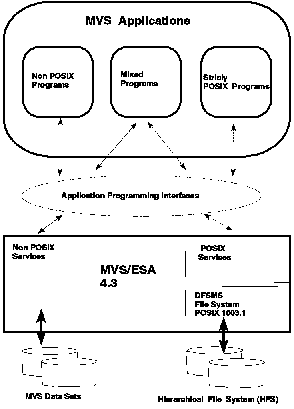

[Previous](2-4-1.md) | [Index](README.md) | [Next](2-4-3.md)

---

### 2.4.2 POSIX Compliance

standards are now supported in IMS applications. [Figure 4](4.png) shows the architecture of MVS OpenEdition.

Figure 4. MVS OpenEdition

---

[Previous](2-4-1.md) | [Index](README.md) | [Next](2-4-3.md)
