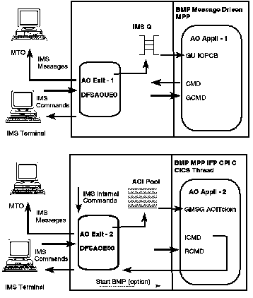

[Previous](4-1.md) | [Index](README.md) | [Next](4-1-2.md)

---

### 4.1.1 Overview

```text
   The IMS Automated Operator Interface is a set of functions that allows
   more efficient operation of the IMS system.  As mentioned earlier, there
   are now in IMS 5.1 two AOI facilities:

   1.  AOI - Type 1, the AOI facility provided in earlier IMS releases, which
```

exists for the IMS TM environment only. The AO exit routine used is the Automated Operator Exit - Type 1 (DFSAOUE0), and it uses the IMS message queues for inserting messages to transactions or LTERMs. An AO application corresponding to such a transaction can: Issue GU/GN calls to retrieve messages routed by the AO exit through the IMS message queue

Issue DL/1 CMD calls to issue operator commands

Issue DL/1 GCMD calls to retrieve command responses( 2. AOI - Type 2, new in IMS 5.1, which exists for both TM and DBCTL

environments This new AOI contains: A new user exit routine, Automated Operator Exit - Type 2 (DFSAOE00) New DL/1 calls for use by AO applications. For communication between the AO exit and the AO applications, a user-defined AOI token and an in-memory table (instead of the IMS message queues) are used. c.cc 8 The purpose of the exit is to intercept: IMS system messages routed to the master terminal for IMS TM or to the MVS system console in the DBCTL environment IMS commands IMS command responses. After examination of these intercepted messages, the exit can send a message to a new type-2 AO application but without using the message queues. The AO Application - Type 2 can then: Retrieve messages from the Automated Operator Exit - Type 2 (DFSAOE00) Issue various IMS operator commands Retrieve responses to these commands. In both cases, the AO exit and the AO application can be used together or separately, depending on the need of the installation (see [Figure 16](5.png)).

<a id="4302AO1"></a>



PICTURE 5

---

[Previous](4-1.md) | [Index](README.md) | [Next](4-1-2.md)
