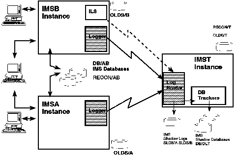

[Previous](5-1-9.md) | [Index](README.md) | [Next](5-1-11.md)

---

### 5.1.10 Examples of Tracking Flow

This section illustrates the concepts introduced in the preceding sections, by showing the steps involved for normal tracking and for the

case when tracking is interrupted for some reason. [Figure 21](10.png) shows the system components.

Figure 21. Sample Tracking Configuration

All of these procedures are detailed in the IMS/ESA V5 Operations Guide, SC26-8029..

Subtopics:

- [5.1.10.1 Configuration](#5.1.10.1)
- [5.1.10.2 Normal Flow](#5.1.10.2)
- [5.1.10.3 Interrupted Flow](#5.1.10.3)
- [5.1.10.4 Planned Takeover](#5.1.10.4)
- [5.1.10.5 Unplanned Takeover.](#5.1.10.5)

---

[Previous](5-1-9.md) | [Index](README.md) | [Next](5-1-11.md)
