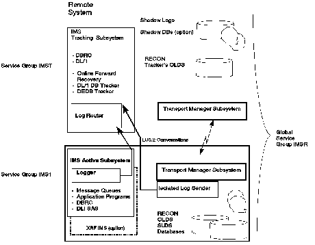

[Previous](5-1-7.md) | [Index](README.md) | [Next](5-1-9.md)

---

### 5.1.8 Active Site Components

[Figure 20](9.png) shows the IMS and RSR components involved in the remote recovery process.

Figure 20. RSR Components

.

Subtopics:

- [5.1.8.1 Transport Management Subsystem](#5.1.8.1)
- [5.1.8.2 IMS Logger](#5.1.8.2)
- [5.1.8.3 Isolated Log Sender.](#5.1.8.3)

---

[Previous](5-1-7.md) | [Index](README.md) | [Next](5-1-9.md)
