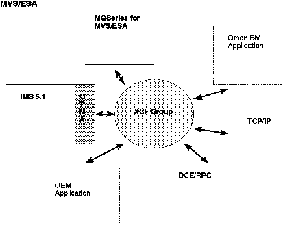

[Previous](6-0.md) | [Index](README.md) | [Next](6-1-14.md)

---

## 6\.1 Open Transaction Manager Access

Open Transaction Manager Access \(OTMA\) is a base component of IMS 5\.1 that provides an access path and an interface specification for sending and receiving transactions and data from IMS\.

Traditionally, IMS transactions have been entered at a terminal on a Systems Network Architecture \(SNA\) network, transmitted to an MVS application \(VTAM\), and then passed on to IMS by VTAM\. Now other types of networks \(non\-SNA\) need to be supported, the most notable being TCP/IP\. The MVS based product supporting the TCP/IP network is TCP/IP for MVS\. Clearly then there is a requirement for IMS to communicate with TCP/IP for MVS\. Further, three emerging standards for client/server processing \(conversational, remote procedure call, and messaging and queueing\) are supported on the MVS platform, as follows:

<a id="TBLTBLUNIQ17"></a>

```
   Conversational                                    APPC/MVS
   DCE/RPC                                           MVS OpenEdition + Application Server/IMS
   Messaging and Queueing                            MQSeries for MVS
```

It is very important for IMS to support all three of these programming models\.

IMS 4\.1 fully supports the conversational model using the LU6\.2 protocol through VTAM and APPC/MVS\. In IMS 5\.1, OTMA provides the facility for IMS to communicate very efficiently with MVS applications other than VTAM, such as TCP/IP for MVS, Application Server/IMS, and MQSeries for MVS\.

Refer to ["The Open IMS Server" in topic 8\.5](8-5.md) for more information about this open world\. OTMA communicates with MVS applications using MVS's high\-performance XCF function\. OTMA and the MVS applications compose an *XCF group*, where OTMA and the applications are *group members*\. In a Parallel Sysplex environment, different members can be on different MVS images\.

OTMA, through its protocol layer above the XCF API, provides to the other group members an interprocess communication mechanism for accessing IMS applications \(see [Figure 26](11.png)\)\.

<a id="FIG4302OX"></a>



*Figure 26\. XCF Utilization with OTMA*

Subtopics:

- [6\.1\.1 Tpipes Concept](<#6.1.1>)
- [6\.1\.2 Services](<#6.1.2>)
- [6\.1\.3 Supported Functions](<#6.1.3>)
- [6\.1\.4 Message Structure](<#6.1.4>)
- [6\.1\.5 Message Flow: OTMA Client to IMS Server](<#6.1.5>)
- [6\.1\.6 Message Flow: IMS Client to OTMA Server](<#6.1.6>)
- [6\.1\.7 Tpipe Synchronization](<#6.1.7>)
- [6\.1\.8 Commit Mode Summary](<#6.1.8>)
- [6\.1\.9 Typical MVS Clients](<#6.1.9>)
- [6\.1\.10 Distributed Syncpoint Processing](<#6.1.10>)
- [6\.1\.11 Security](<#6.1.11>)
- [6\.1\.12 Message Sequence](<#6.1.12>)
- [6\.1\.13 Resynchronization](<#6.1.13>)
- [6\.1\.14 Implementing OTMA](6-1-14.md)

---

[Previous](6-0.md) | [Index](README.md) | [Next](6-1-14.md)
