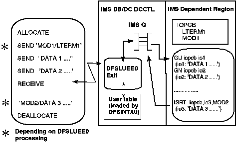

[Previous](6-4-3.md) | [Index](README.md) | [Next](6-4-5.md)

---

### 6.4.4 Functional Flow

[Figure 31](15.png) shows a sample implementation of APPC/IMS message mapping support.

<a id="4302MOD"></a>



Figure 31. APPC/IMS Message Mapping Support

```text
    ________________________________________________________________________ 
   |                                                                                  |
   |                                                                                  |
   |                                                                                  |
   |                                                                                  |
```

In this example, the steps are: 1. The LU6.2 application program sends both an LTERM and a MODname in the first segment of the input message. The format of this first segment is mutually defined by the remote programs and the LU6.2 Edit Exit (DFSLUEE0). (Either or both fields can be sent.) 2. DFSLUEE0 is used to: View and change the contents of a message segment before storing it in the message queue Discard a message segment (appropriate in this example) DEALLOCATE_ABEND the LU6.2 conversation. 3. For the input message, DFSLUEE0 checks the contents of the first message segment, consults the user tables loaded by the Initialization User Exit (DFSINTX0), and decides whether to pass the LTERM and/or MODnames to IMS in the IOPCB. 4. For the first segment of the output message, IMS provides the MODname to DFSLUEE0, which can format the message accordingly or simply include the MODname in the output message sent to the LU6.2 partner.

---

[Previous](6-4-3.md) | [Index](README.md) | [Next](6-4-5.md)
