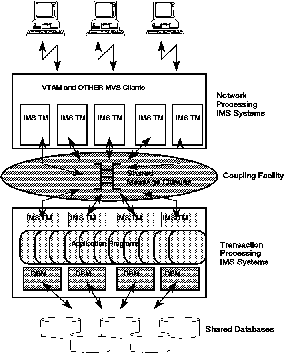

[Previous](8-1-4.md) | [Index](README.md) | [Next](8-2.md)

---

### 8.1.5 Parallel Sysplex

Customers today run IMS systems that range in size from small to large to huge. At the high end, some customers see a continuing growth in transaction volumes that will be impossible to meet with a single large processor. Regardless of IMS system size, almost all IMS customers are looking to further reduce the cost of each transaction. The IBM solution to both requirements is the Parallel Sysplex. This allows many MVS systems to be loosely coupled but provide a single system image to the end user. The MVS systems can be run on the traditional . bipolar processors (ES/9000s), in which case the aggregate processor power available becomes very considerable. Alternatively (or in addition), the MVS systems can be run on the new CMOS based processors, which provide computing power at significantly reduced cost. In both cases, the MVS architecture is the same. IMS is now evolving to fully participate in this new MVS Parallel Sysplex architecture. IMS 5.1 introduces Parallel Sysplex support for IMS databases, often referred to / as n-way sharing. With IMS 5.1 it is possible to run multiple IMS TM,

CICS DBCTL, and batch systems across multiple MVS systems, all reading and updating the shared databases efficiently and with integrity.

A subsequent release of IMS will provide exploitation of the new MVS architecture by the IMS Transaction Manager. The IMS message queues will exploit the Coupling Facility and be a single sysplexwide resource at the heart of the IMS sysplex. Logically, the function of the IMS systems can be considered to be split into network driving and transaction processing. Network driving IMS systems will be receiving messages from the various networks (SNA and non-SNA) and placing them on shared message queues. Transaction processing IMS systems will be taking messages off the queues and inserting replies back to the queues. The network driving IMS systems will then take the replies from the queues and send them to their final

destinations. This conceptual view is illustrated in [Figure 33](16.png).

PICTURE 16

---

[Previous](8-1-4.md) | [Index](README.md) | [Next](8-2.md)
