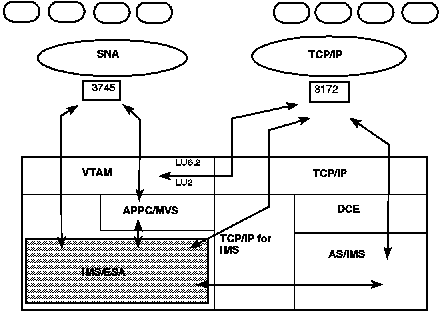

[Previous](8-5-2.md) | [Index](README.md) | [Next](8-5-4.md)

---

### 8.5.3 TCP/IP Network Access

SNA and TCP/IP networks. TCP/IP network. APPC/IMS. [Figure 42](25.png) shows the different routes to access IMS transactions from either SNA or TCP/IP networks.

PICTURE 25 Figure 42. TCP/IP Access

Subtopics:

- [8.5.3.1 TCP/IP for MVS](#8.5.3.1)
- [8.5.3.2 LU2 over TCP/IP Network](#8.5.3.2)
- [8.5.3.3 APPC over TCP/IP Network](#8.5.3.3)
- [8.5.3.4 TCP/IP for IMS](#8.5.3.4)
- [8.5.3.5 TCP/IP for IMS Message Flow.](#8.5.3.5)

---

[Previous](8-5-2.md) | [Index](README.md) | [Next](8-5-4.md)
