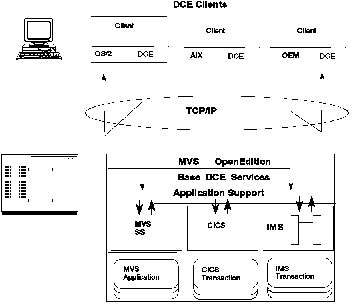

[Previous](8-5-3.md) | [Index](README.md) | [Next](8-5-5.md)

---

### 8.5.4 DCE/RPC Support Through AS/IMS

The remote procedure call allows applications to access procedures on a

network as if they were local subroutines.

IMS supports the Open Software Foundation's Distributed Computing Environment (OSF/DCE) RPC model, in cooperation with MVS OpenEdition and OpenEdition Application Server/IMS (AS/IMS).

Figure 45. DCE/RPC Implementation

[Figure 45](28.png) to see how the DCE/RPC support is implemented to give access to existing IMS applications. One objective of DCE/RPC is to simplify the development of distributed applications by removing the overhead of writing communications code. Another objective is to allow existing applications to be distributed with minimal change. The IMS Transaction Manager can participate as a server in a DCE complex. Any open platform supporting DCE can initiate IMS or CICS transactions and can access IMS or DB2 databases. AS/IMS and AS/CICS are the interfaces between the Transaction Manager and the DCE environment and form a bridge between the new heterogeneous world of DCE and the traditional world of MVS. The application servers thus not only protect the existing investment but also minimize connection costs..

Subtopics:

- [8.5.4.1 RPC Client](#8.5.4.1)
- [8.5.4.2 IMS RPC Server](#8.5.4.2)
- [8.5.4.3 IMS Restrictions When Using AS/IMS.](#8.5.4.3)

---

[Previous](8-5-3.md) | [Index](README.md) | [Next](8-5-5.md)
