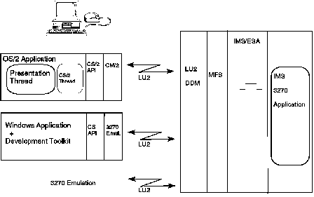

[Previous](8-5-4.md) | [Index](README.md) | [Next](8-5-6.md)

---

### 8.5.5 Remote Procedure Call with the IMS Client Server Products

. The IMS Client Server family of produ**cts**, **IMS** CS/2 **an**d **I**M**S C**S **for Wi**ndows, provides an implementation of RPC. There is a simple callable programming interface for workstation applications. It is used to call existing IMS applications that are accessible using the SNA LU2 protocol and use MFS 3270 screens. The objectives of these products are to: Protect and build on the existing investment in IMS 3270 applications Bridge host data into the OS/2 or Windows environments Provide application programmers with an easy-to-use API that will help in creating client/server solutions Enable customers to benefit from the power of the workstation (GUI interface, for example) and LAN connections* Facilitate use of state-of-the-art programming tools to deliver new functions quickly and efficiently.  Workstation applications can provide services such as: GUI Integration of stored audio data Drag-and-drop utilization Execution of multiple IMS transactions to service one user request Online help. [Figure 46](29.png) illustrates the IMS Client Server products.

Figure 46. IMS Client Server Products

.

Subtopics:

- [8.5.5.1 IMS Client Server/2](#8.5.5.1)
- [8.5.5.2 IMS CS for Windows.](#8.5.5.2)

---

[Previous](8-5-4.md) | [Index](README.md) | [Next](8-5-6.md)
