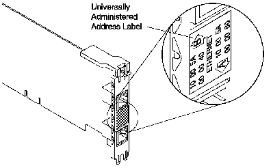

[Previous](1-0.md) | [Index](README.md) | [Next](1-2.md)

---

## 1.1 Reading the Address on the Adapter Label

[Figure 1-1](2.png) illustrates the label on the bracket of the Dual EtherStreamer MC 32 Adapter.

Figure 1-1. The Adapter Label

The universally administered address label shows the adapter's universally administered addresses for each port. These are the medium access control

The 12-digit hexadecimal addresses are recorded on the label in 2-digit increments from left to right, starting on the first row. In the illustration, the universally administered address for port A is X'1000 5A00 0080' and the address for port B is X'1000 5A00 0040' in canonical format.

The universally administered address is unique and is used by network software to distinguish the adapter from others on the network. If you would prefer the adapter to be known on the network by a locally administered address, you must configure the adapter's device driver or protocol driver to use a locally administered address. The procedure under ["Configuring the Adapter" in topic 2.5](2-5.md) will guide you through configuring parameters such as the address.

---

[Previous](1-0.md) | [Index](README.md) | [Next](1-2.md)
