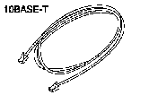
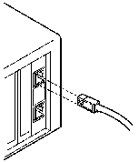

[Previous](2-3.md) | [Index](README.md) | [Next](2-5.md)

---

## 2.4 Connecting the Adapter to the Network

- **1.** Use two Category 3, 4, or 5 cables with RJ-45 connectors.

PICTURE 7

Connect the cables to the adapter and the network.

**Note:** The maximum length of twisted-pair cable between the concentrator and the workstation is 328 feet (100 meters).

PICTURE 8

- [HDRCONFIG](2-5.md) **2.** Continue with "Configuring the Adapter" in topic 2.5.

---

[Previous](2-3.md) | [Index](README.md) | [Next](2-5.md)
