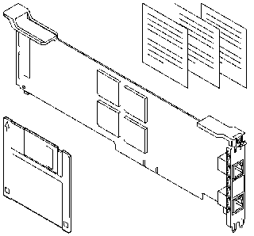

[Previous](contents.md) | [Index](README.md) | [Next](preface.md)

---

# FRONT_1 Package Contents

PICTURE 1

- The IBM* Dual EtherStreamer* MC 32 Adapter
- The Dual EtherStreamer MC 32 Adapter Option diskette
- The Safety Information manual
- The IBM Program Licence Agreement sheet
- This publication

If you have a five-pack shipment, your kit contains five adapters, one diskette, one safety information booklet, one IBM program Licence Agreement, and this manual.

---

[Previous](contents.md) | [Index](README.md) | [Next](preface.md)
