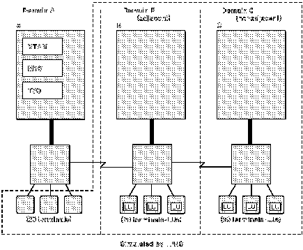

[Previous](5-2-2.md) | [Index](README.md) | [Next](5-2-4.md)

---

## 5.2.3 Step 3:  Determining the Logical Configuration

After you have identified what resources you want to simulate, you can determine the logical configuration of the network. The logical

configuration for the example TPNS test is shown in [Figure 4](comments.md#logical). In this figure, the resources that are simulated by TPNS are shown within the labelled dashed line.

Figure 4. Logical Configuration of Example Computer System. The dashed lines indicate domain boundaries. The labelled dashed lines enclose resources simulated by TPNS.

<> Notice that the configuration sho [wn in Fi](comments.md#logical) gure 4 is almost the same as the configuration shown in [Figure 3](2.png). This is because you decided to simulate the real configuration of your network, with the exception of a number of terminals. In other TPNS tests, the logical configuration may not resemble your actual configuration because you may be simulating only a portion of your network, nonexistent resources, or entirely different configurations. In [Figure 4](comments.md#logical), Domain A contains both actual resources and simulated resources. Domains B and C, however, are entirely simulated. In this <BOOK> example, Domain B is an adjacent domain because it is directly adjacent to <> the system under test. Domain C is a nonadjacent domain because it is not adjacent to the system under test. For Domain C to communicate with the <BOOK> resources in Domain A, the traffic must be routed through Domain B.

---

[Previous](5-2-2.md) | [Index](README.md) | [Next](5-2-4.md)
