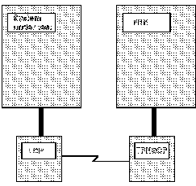

[Previous](5-2-3.md) | [Index](README.md) | [Next](5-2-5.md)

---

## 5.2.4 Step 4:  Identifying the Physical Configuration

After you have determined the logical configuration, you can identify the physical configuration you need to conduct the TPNS test. The physical configuration includes the resources in the system under test as well as the resources needed to operate TPNS. You can operate TPNS in the following three physical configurations:

**VTAMAPPL** **configuration** You use this configuration to simulate primary and secondary logical units

in the same subarea as VTAM. These logical units can have a session with <> any other logical unit that VTAM will allow a session to be started with. VTAMAPPL is the easiest configuration to use since you do not need a communication controller.

**Link-attach** **configuration** You use this configuration to simulate terminals and link-attached Type 2.1 nodes in the same domain as the system under test. You can also simulate terminals on an IBM Token-Ring Network using the link-attach configuration. Additionally, you can use the link-attach configuration to

the NCP, and the physical and logical units. In this case, the <> cross-domain resources are link attached to the system under test. TPNS requires its own communication controller and a TPNS control program for the link-attach configuration.

**Direct-attach** **configuration** You use this configuration to simulate subarea resources such as the SSCP, the NCP, and the physical and logical units that are in a different domain from the system under test. You can also use this configuration to simulate Type 2.1 nodes that are channel attached to a communication controller loaded with a control program that supports boundary channel

attachment. When you use the direct-attach configuration, you cannot simulate terminals in the same domain as the system under test nor can you <> simulate cross-domain links between the NCP in the system under test and a <> simulated NCP. In the direct-attach configuration, TPNS shares a communication controller and its NCP with the system under test and does not require a TPNS control program.

In the example discussed in the previous section, you want to simulate

terminals in the same domain as the system under test and resources in adjacent and nonadjacent domains that are link attached to the system <> under test. Therefore, you need to use the link-attach physical configuration. You can generate the TPNS control program for your configuration using the generation libraries supplied with TPNS. Refer to [<BOOK> <> <> <SC31-600](#LNK) 8> <> <TPNSDF> Defining TPNS Networks for more information about generating a TPNS control program. [Figure 5](comments.md#physica) shows the link-attach configuration that you would use to conduct the TPNS test for this example.

Figure 5. Physical Configuration of Example Computer System

Notice that TPNS is running in a different host from the system under test. This is not a requirement; however, because you are conducting a performance test, you want to ensure that TPNS operation does not affect the performance of the system under test. Also notice that the TPNS control program (TPNSCP) is in the communication controller that is connected to the host running TPNS.

---

[Previous](5-2-3.md) | [Index](README.md) | [Next](5-2-5.md)
