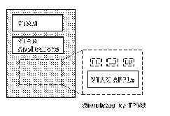
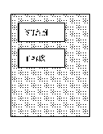

[Previous](5-3.md) | [Index](README.md) | [Next](5-3-1-1.md)

---

## 5.3.1 VTAM Application Simulation

[Figure 6](comments.md) illustrates the logical configuration of a network in which you want to simulate SNA logical units that are accessing a VTAM application. These logical units could represent terminals or other VTAM applications. You would use this logical configuration to test VTAM applications or / subsystems such as IMS/VS, Customer Information Control System/Virtual about Storage (CICS/VS) or TSO. This VTAM subarea could be part of a large network with many other nodes.

Figure 6. Logical Configuration for VTAM Application Simulation

[FIGVTAM](6.png) Figure 7.

Figure 7. Physical Configuration for VTAM Application Simulation

programs. VTAM. multiple as well as parallel half-sessions. Refer to [Appendix E, "Summary](comments.md) [of Logical Unit (LU) Types"](comments.md) for a description of these logical unit types. Note that this configuration does not attempt to present entirely realistic terminal simulation timings since TPNS performs the simulation entirely within its software. Various system components, such as the host processor, operating system, and even VTAM, "know" that these are not real physical terminals. However, TPNS presents a logically realistic simulation of local SNA primary and secondary logical units to the other half-session.

Subtopics:

- [5.3.1.1 Using the VTAMAPPL Configuration](5-3-1-1.md)
- [5.3.1.2 Testing Application Development](5-3-1-2.md)

---

[Previous](5-3.md) | [Index](README.md) | [Next](5-3-1-1.md)
