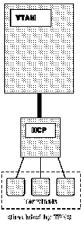
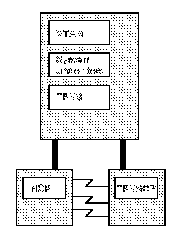
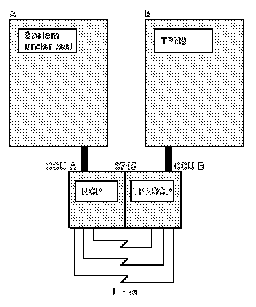

[Previous](5-3-1-2.md) | [Index](README.md) | [Next](5-3-2-1.md)

---

## 5.3.2 Terminal Simulation

[Figure 8](7.png) illustrates the logical configuration of a single-domain network in which you want to simulate terminals.

Figure 8. Logical Configuration for Simulating Terminals in a Single-Domain Network

[Figure 4](3.png) illustrates the logical configuration of a multiple-domain network in which you want to simulate the following: Terminals in the same domain as the system under test Adjacent and nonadjacent domains. configurations is known as link-attach. [Figure 9](8.png) shows the link-attach configuration you would use for a 3725 or 3720 communication controller or for a 3745 communication controller in which only one communication <BOOK> control unit (CCU) is installed. You can also use this configuration for a 3745 communication controller that uses two CCUs if one of the CCUs is not being used for the TPNS test. [FIG3745](9.png) Figure 10 shows the link-attach configuration you would use for a 3745 communication controller that uses both of the CCUs for the TPNS test. In also this configuration, **the** **CCUs** **are** **operating** **in** **twin** **dual** **mode**. One CCU <BOOK> contains an NCP, and the other contains a TPNS control program. Both CCUs run simultaneously, and each CCU controls its own resources.

**Note:** TPNS will not run on a 3745 communication controller in twin standby mode (only one CCU active with the other CCU in standby mode) or in twin backup mode (only one CCU active with the other CCU in backup mode).

PICTURE 8

Figure 10. Physical Configuration for Terminal Simulation Using an IBM 3745 Communication Controller with Two CCUs

Synchronous Data Link Control (SDLC). You can also use the link-attach configuration to simulate the resources about attached to 8100 processors, X.25 packet-switched networks, IBM Token-Ring Networks, and Type 2.1 nodes. When you use the link-attach configuration, you can simulate entire subareas in an SNA domain that are link attached to the system under test. <BOOK> These subareas include the SSCP, the NCP, and all the physical and logical units controlled by the NCP. In this situation, TPNS enables you to drive cross-domain links. You also use the link-attach configuration to <> simulate entire X.25 networks and Type 2.1 nodes. :H3 be. For this reason, VTAM, the NCP, and so on "think" that they are communicating with a real device.

**Note:** The TPNS communication controller is not link attached to a communication controller in the system under test if you are using an Enterprise System/9370* (ES/9370)* with an integrated communication adapter (ICA).

Subtopics:

- [5.3.2.1 Using the Link-Attach Configuration](5-3-2-1.md)
- [5.3.2.2 Using the ES/9370 with a Token-Ring Adapter](5-3-2-2.md)

---

[Previous](5-3-1-2.md) | [Index](README.md) | [Next](5-3-2-1.md)
