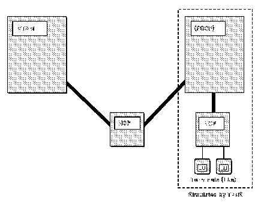
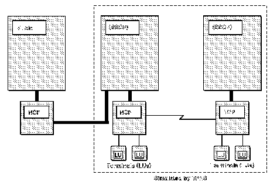
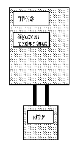
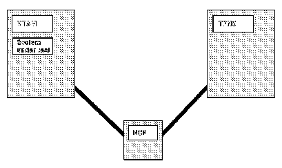

[Previous](5-3-2-2.md) | [Index](README.md) | [Next](5-4.md)

---

## 5.3.3 Subarea Simulation

[Figure 11](10.png) illustrates the logical configuration of a network in which you want to simulate the subareas in an adjacent domain. In this situation, logical units in the adjacent domain drive the application in the system under test.

Figure 11. Logical Configuration for Simulating Logical Units in an Adjacent Domain

[Figure 12](11.png) illustrates the logical configuration for a multiple-domain network in which you want to simulate more than one domain. The logical units in the simulated domains drive the applications in the system under test. You can use this configuration to test applications or various components in the real system.

Figure 12. Logical Configuration for Simulating Logical Units in Both Adjacent and Nonadjacent Domains

[FIGDIRE1](12.png)

PICTURE 12

Figure 13. Physical Configuration for Subarea Simulation Using One Host

not control NCP resources (lines, terminals, and so on). [Figure 13](12.png) shows TPNS and the applications in the same host processor. This is not a requirement; you can run TPNS in a second host as shown in [Figure 14](13.png).

Figure 14. Physical Configuration for Subarea Simulation Using Two Hosts

---

[Previous](5-3-2-2.md) | [Index](README.md) | [Next](5-4.md)
