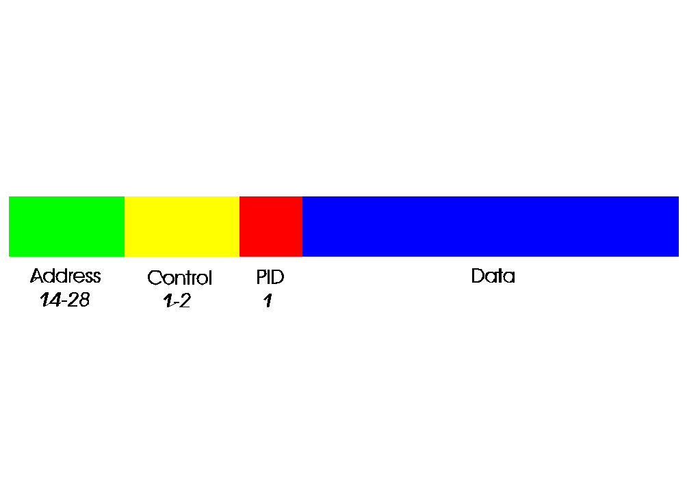

[Previous](2-1-2.md) | [Index](README.md) | [Next](2-1-4.md)

---

##### 2.1.3 Packet Format

$ As you may imagine, UI frames are often used for beacons or to carry additional network protocols. Now, examine the following diagram of an

PICTURE 2 Figure 2. AX.25 frame

Note that the image here is good for either a numbered or unnumbered frame - (that is, connected-mode or unconnected-mode). It is a good idea to break down the packet structure for additional clarity:

- $ Address: the address field here is variable-length (as shown, 14 to 28 bytes) since this can accommodate a plain source/destination pair or _

***up*** t***o ***tw***o d***ig***ipeaters. A*** di*g*ip*eater is a* p*ac*k*e*t* repea*t*er syste*m*,*

/ *usually* *simplex;* *you* *can* *only* *have* *two* *digipeaters* *along* *a* *path!*

- * Control: this conveys the field type, seen in the above list; it may span two bytes -- this is necessary to accommodate the sequence

***a***d***dr***e***s***s numbers (which run 0 to 7 so 4 bits; N(R) andN(S) fit nicely in one byte together)

- PID (Protocol ID): this specifies the protocol contained within the

! - 0x01: ISO 8208 (X.25 Packet Layer Protocol) [(6)](#FTNFTNUNIQ8)

- 0x06: VJ-compressed TCP/IP [(7)](#FTNFTNUNIQ9)

- ! - 0x07: VJ-compressed TCP/IP (for an uncompressed frame)
- - 0x08: Segmentation fragment
- - 0xC3: TEXNET Datagram Protocol

- 0xC4: Link Quality Protocol (LQP)

- - 0xCA: AppleTalk
- - 0xCB: AARP (AppleTalk)
- - 0xCC: IPv4
- - 0xCD: ARP (ARPA)
- - 0xCE: FlexNet
- - 0xCF: NET/ROM
- - 0xF0: no layer-3 protocol; the payload is raw text
- - 0xFF: escape character for a two-byte protocol field

an *; T*he* **"n*o *layer-3**"* A*X.25 *op*erating m*od*e is* u*se*d* for* *con*n*ections fro*m* a -* *packet* *terminal* *to* *a* *BBS* *or* *packet* *radio* *command-line* *shell* *node.*

( In an unconnected state, you can send and receive UI-frames by using some specific command that the TNC or packet stack provides; there is no

( acknowlegement. In a connected state, I-frames are sent instead and both ( sides expect to exchange those RR frames. The window size controls how * many packets each side can exchange before a RR frame must be sent. $ Finding a good window size is crucial to reliable network links! As

( mentioned above, the sequence numbers run 0 to 7, and so does the range for possible window size values. **A** **Bigger** **Window **There is a mechanism to get more than 8 packets in a window, and it is ***! called modulo-128; it lengthens the size of the control field to three -- bytes (with byte 1 being the frame type, byte 2 being the modulo-8 ) window size, and byte 2 and 3 together being the modulo-128 window $ size). Most packet radio stacks support this, but no real TNCs do as far as I am aware***.

---

(6) See the section on ROSE for more information on this..

[Back](#fnref-FTNFTNUNIQ8)

(7) This is the same compression algorithm used for "IP Header Compression" on PPP networks..

[Back](#fnref-FTNFTNUNIQ9)

---

[Previous](2-1-2.md) | [Index](README.md) | [Next](2-1-4.md)
