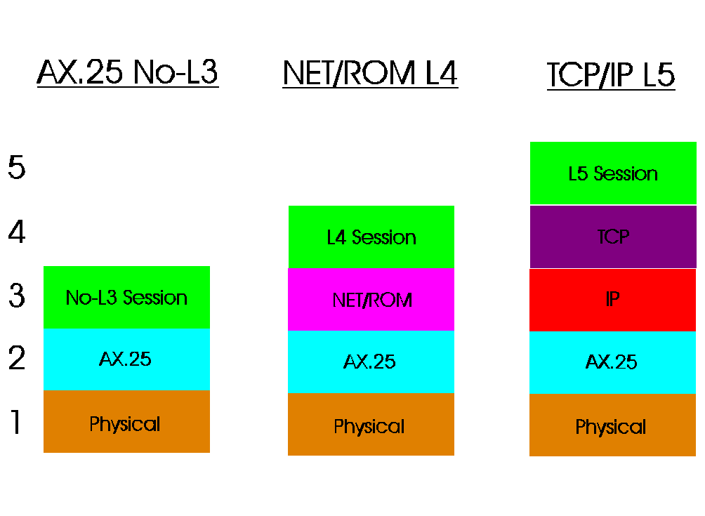

[Previous](2-2.md) | [Index](README.md) | [Next](2-2-2.md)

---

##### 2.2.1 Addressing Scheme

*Rath*e*r th*an relying on callsigns explicitly, NET/ROM often uses node name *aliases.* For instance, your BBS could be namedNYBBS, and your own node ( could be named WECNOD. In order to build up a collection of nodes and ( adjacency, NET/ROM nodes emit node broadcasts on a fixed timer (which is ( inevitably changeable by the user); once adjacent nodes receive these

Some packet radio stacks (namely XRouter) refer to a NET/ROM connection as > a "layer 4" connection; by a contrast, a no-L3 connection would be a "layer 2" connection. [(10)](#FTNFTNUNIQ14)

**So,** **what** **are** **all** **these** **layers**

Network stacks are divvied up into "layers," and this notation is used to conceptualize network protocol families. To provide you with a visual overview, please see the below image.

PICTURE 5 Figure 5. Packet radio protoc

---

-- (10) Remember, a no-L2 connection is a plain AX.25 textual connection!.

[Back](#fnref-FTNFTNUNIQ14)

---

[Previous](2-2.md) | [Index](README.md) | [Next](2-2-2.md)
