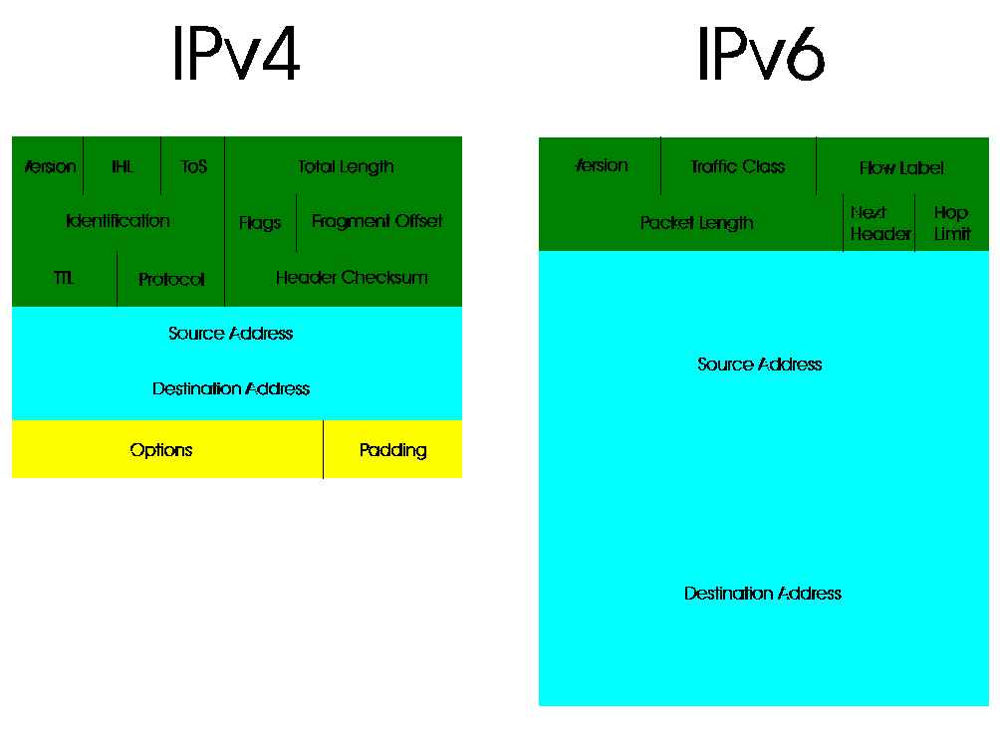

[Previous](2-3.md) | [Index](README.md) | [Next](2-4-1.md)

---

### 2\.4 Internet Protocol

Despite many efforts to establish some alternate protocol as the dominant network protocol of the world, the *ARPA Internet Protocol* became the world standard; you probably used IP to get this document\!

IP is very often seen alongside several other protocols riding on top of it:

- `TCP` \(Transmission Control Protocol\), used to set up virtual circuits with reliable connections that handle dropouts, unexpected disconnections, and other similar failures
- `UDP` \(User Datagram Protocol\), used to transmit non\-reliably\-delivered datagrams between hosts
- `ICMP` \(Internet Control Message Protocol\), used to allow network hosts to test communication \(this is the `ping` command\), detect adjacent routers \(ICMP redirects\), and alert hosts that UDP ports are not listening
- `SCTP` \(Stream Control Transmission Protocol\), an evolved version of TCP that never caught on

The structure of an IP packet is as follows:

*Figure 6\. IPv4 and IPv6 Packets*

The source and destination IP addresses can be seen, as well as the **protocol** number, which will be discussed further down\. The **TTL** \(Time\-to\-Live\) field specifies the amount of routing hops a packet can take before routers will stop routing it\.

Subtopics:

- [2\.4\.1 IPv4 and IPv6](2-4-1.md)
- [2\.4\.2 Subnetting](2-4-2.md)
- [2\.4\.3 Link\-Layer Address Resolution](2-4-3.md)
- [2\.4\.4 Address Classes](2-4-4.md)
- [2\.4\.5 TCP and UDP](2-4-5.md)
- [2\.4\.6 Tunnels](2-4-6.md)

---

[Previous](2-3.md) | [Index](README.md) | [Next](2-4-1.md)
