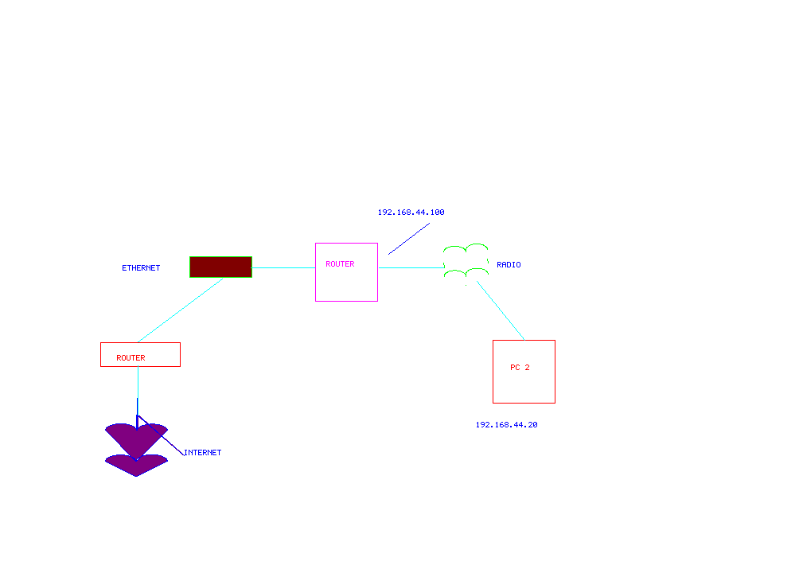

[Previous](3-3-2.md) | [Index](README.md) | [Next](3-4.md)

---

##### 3.3.3 Routing - NAT

If you wish to access the Internet via packet radio, you will need to [FTNFTNUNIQ31](#FTNFTNUNIQ31) employ **NAT** (Network Address Translation) routing. (21)

Examine the following image to visualize the setup:

<a id="FIGUNIQ32"></a>



Figure 8. IP NAT Example

Note that the IP addresses on the Ethernet subnet are no longer

```text
# iptables -t nat -a POSTROUTING -o eth0 -j MASQUERADE
AND
a      # iptables -A FORWARD -i eth0 -o ax0 -m state --state RELATED,ESTABLISHED -j ACCEPT *
# iptables -A FORWARD -i ax0 -o eth0 -j ACCEPT
```

So, what's going on here Well, whenever a host on the packet radio subnet sends packets directed at the Internet, they will be transmitting them to the packet routing node. It will then modify the packet's source and destination address such that the packets look like they are coming from the packet routing node PC; at the same time, the router attached to the internet connection and Ethernet LAN does the same thing. [(22)](#FTNFTNUNIQ33)

---

<a id="FTNFTNUNIQ31"></a>

(21) "NAT" used here is a colloquial term for what Cisco IOS calls NAT **Ov**er**load, s**ome network engineers call PAT **(Po**rt Address Translation), and Windows calls "Internet Connection

<a id="FTNFTNUNIQ33"></a>

-- (22) This is a "double-NAT" setup, since it does not require entering any routes on that edge router.

---

[Previous](3-3-2.md) | [Index](README.md) | [Next](3-4.md)
