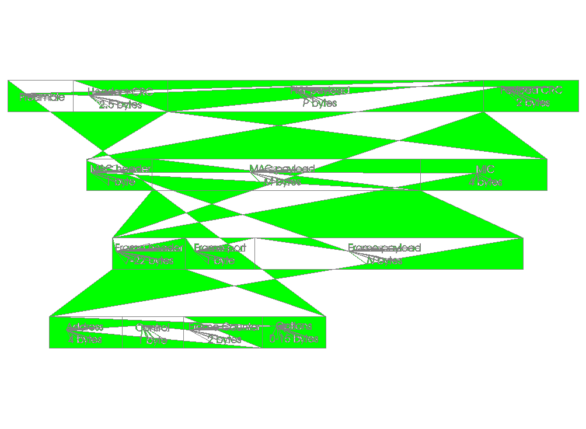

[Previous](7-1-2.md) | [Index](README.md) | [Next](7-2.md)

---

### 7\.1\.3 LoRa Packet Format

For visual continence, the LoRa packet structure is as follows:

*Figure 9\. LoRa Frame Format*

---

[Previous](7-1-2.md) | [Index](README.md) | [Next](7-2.md)
