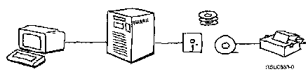

[Previous](1-1.md) | [Index](README.md) | [Next](1-3.md)

---

## 1.2 A Typical Computer System

Computers come in many forms and are used for many different things. Here

are a few ways computers can be used: In an office: To help prepare, store, and distribute documents In a warehouse: To keep track of inventory so that you always have items in stock and don't carry unnecessary items In a laboratory: To analyze the results of experiments In a doughnut factory: To control the amount of ingredients so the holes are uniform Although computers can be very different from one another, they all have some things in common. They all do their work using three main operations: **Input** Receiving data typed on a keyboard **Process** Adding numbers together or comparing two values to see if they are the same **Output** Presenting results on a display or printer The order in which these operations take place is controlled by a set of instructions called a **program**. When you want to accomplish a task, this set of instructions is given to the computer. Although you will use many programs on the AS/400 system, the most important programs, the ones which control the basic functions of the whole system, make up the **operating** **system**. During each of the three main operations, the data has to be stored somewhere. **Storage** is a fourth operation that a computer system performs.

There are many different devices for input, process, output, and storage. When they are connected together, you have a computer system. In a typical system the keyboard sends data to the processor, which puts it into a storage device. The processor takes data from storage, processes it according to the program, and places the results back into storage. Finally, the processor takes the results from storage and passes them to the display (screen) or a printer.

PICTURE 2.

---

[Previous](1-1.md) | [Index](README.md) | [Next](1-3.md)
