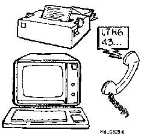

[Previous](1-3.md) | [Index](README.md) | [Next](1-5.md)

---

## 1\.4 Output Devices

An output device is any device that takes data in the form of electronic signals that the computer understands and changes them into data or actions outside the computer system\.

The most common output device is a display\. Other examples of output devices are:

- Printers: One of the most common output devices\. Printed output can be in many forms, from a complex report of hundreds of pages to a sales receipt from the supermarket checkout counter\.
- Computer\-produced speech: In the United States, when you call for directory assistance, the computer responds to your push button telephone by using computer\-produced speech\.

Often an input device and output device are combined in one physical unit\. You're probably using one right now: your **display station**\.

Input devices, output devices, and devices that combine both input and output are sometimes referred to as **work stations**\.

---

[Previous](1-3.md) | [Index](README.md) | [Next](1-5.md)
