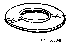

[Previous](1-5-1.md) | [Index](README.md) | [Next](1-5-3.md)

---

### 1.5.2 Magnetic Disks

PICTURE 6.

it is called a disk drive.

---

[Previous](1-5-1.md) | [Index](README.md) | [Next](1-5-3.md)
