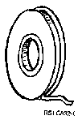

[Previous](1-5-3.md) | [Index](README.md) | [Next](1-6.md)

---

### 1.5.4 Magnetic Tapes

PICTURE 8.

to magnetic tape is a tape drive. Like diskettes, tapes are removable and are useful for transferring data from one system to another. Magnetic tape has one important difference from the other storage devices. Data on tape can be read only sequentially. If you want an item of data in the middle of the tape, you have to read the tape from the beginning until you get to it. With a disk or diskette you can go directly to the place where data is stored. Once you have found the data on the tape, you can read it at much the same speed as magnetic disk. A magnetic tape can hold large quantities of data, far more than a diskette can.

---

[Previous](1-5-3.md) | [Index](README.md) | [Next](1-6.md)
