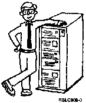

[Previous](1-8.md) | [Index](README.md) | [Next](1-9.md)

---

### 1.8.1 The AS/400 Operating System-OS/400

of any other programs running at the same time. **Control** **Language** Control language is the set of commands used to talk with the computer. **Data** **Management** Data management allows the user to define and use data files. **Work** **Management** Work management controls many jobs, no matter if you are doing several at the same time, or if other people are using the system. **Programmer** **Services** Programmer services provide support for online program development and testing. **System** **Operator** **Services** System operator services provide a menu for easy access to frequently used operator functions. **Communication** **Support** The OS/400 program supports a wide range of communication functions that allow your AS/400 system to communicate with other types of systems as well as other AS/400 systems. **Security** Security protects your valuable work. If you are using a personal computer, you may also have: **PC** **Support** The PC Support program provides a means of attaching your personal computer to your AS/400 system as a programmable work station. The AS/400 system and its brain, the OS/400 program, are truly powerful. But don't be intimidated by them. Understanding how a computer works isn't hard if you remember that the whole system is simply a few components (input devices, processor, output devices, and storage devices), being controlled by an operating system. The remaining chapters will show you how to control the AS/400 system and have it work for you. And Norbert will help.

PICTURE 11.

---

[Previous](1-8.md) | [Index](README.md) | [Next](1-9.md)
