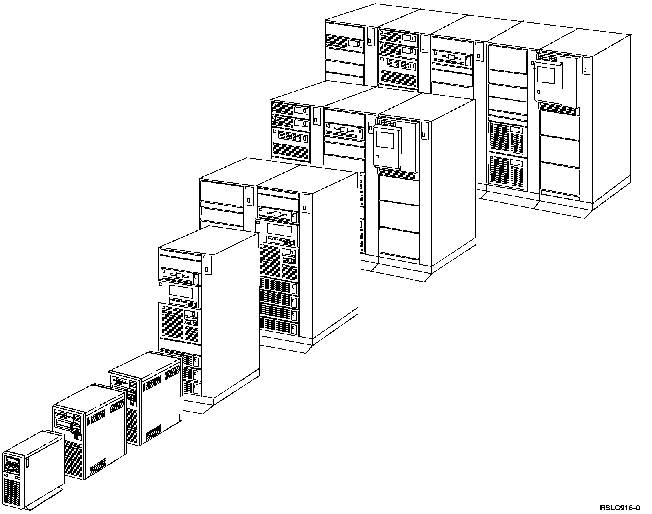

[Previous](1-7.md) | [Index](README.md) | [Next](1-8-1.md)

---

## 1.8 The AS/400 System

PICTURE 9.

commercial applications. The AS/400 system comes in three machine types, each having several models with varying amounts of disk and main storage: 9402 9404 9406 The 9402 and 9404 units are suitable for a department or a small business and will fit under a desk. The 9406 unit will support a large number of users and is housed in **racks**. A rack is similar to a five-drawer filing cabinet.

PICTURE 10.

**Take** **a** **Walk**

When you have a few minutes, find out where your AS/400 system is located. It might be sitting next to you, in the next room, or in another part of the building. Look at the lights on the front panel. It won't hurt; it's friendly.

Subtopics:

- [1.8.1 The AS/400 Operating System-OS/400](1-8-1.md)

---

[Previous](1-7.md) | [Index](README.md) | [Next](1-8-1.md)
