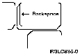

[Previous](2-2.md) | [Index](README.md) | [Next](2-2-2.md)

---

### 2.2.1 What If You Make a Typing Mistake

Find the **Backspace** key located near the upper right corner of your keyboard. (The appearance and exact location of the Backspace key depends on which keyboard you have; this will be explained in the next chapter.)

PICTURE 13

cursor under them and pressing the long **spacebar** at the bottom of your keyboard.

---

[Previous](2-2.md) | [Index](README.md) | [Next](2-2-2.md)
