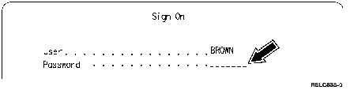
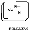
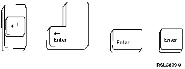

[Previous](2-2-2.md) | [Index](README.md) | [Next](2-4.md)

---

## 2\.3 Your Password

Unlike your user name, your password should not be known by other users\. For security reasons, only you and your **Security Officer** \(person in charge of system security\) know your password\. In fact, to be able to begin using the computer, your security officer should have given you a password to use temporarily\. You can change it if you want; [Chapter 5, "Using](5-0.md) [Displays"](5-0.md) shows you how\. Now that your user name has been entered, press the **Tab** key in the upper left corner of your keyboard, and the cursor will be on the next line ready for you to enter your password\.

Type your password\. Unlike your user name, your password is invisible on the screen\. This is to keep people from looking over your shoulder and seeing your password\. Don't worry about making a mistake while typing your password; it isn't serious\. Even though you can't *see* a spelling mistake, the computer will let you know with an error message:

`Password not correct for user profile.`

The cursor just goes back to the User line\. From there you check that your user name is entered properly \(retyping it if necessary\)\. Then you simply press the Tab key, enter your password again, and away you go again\.

**Note:** The number of times you can make a mistake may be limited on your system \(for security reasons\)\. If you exceed this limit, the system will not let you sign on, and you will have to contact your system operator for help\.

For now, you can ignore the remaining three lines of information on the Sign On display\. Press the Enter key, which is located in the lower right corner of your keyboard\. \(On most personal computers attached to the AS/400 computer, the **Enter** key is directly above the right shift key\.\)

**Note:** At this point, some systems may display a screen called **Sign\-on Information**\. Ignore this display and press the Enter key\.

There, you've done it\. You are now signed on the AS/400 system\.

---

[Previous](2-2-2.md) | [Index](README.md) | [Next](2-4.md)
