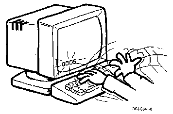
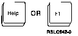

[Previous](2-6.md) | [Index](README.md) | [Next](2-7.md)

---

### 2.6.1 Making Keystroke Mistakes

The computer simply stops, then tells you what is wrong. You make the correction, and you're ready to go again. Can you confuse the computer : Press your Cursor Up key a few times to move your cursor up and away from the command line. Press a few keys at random. Or better yet, place your whole hand on the keyboard and press down. See how many keys you can press at one time. See if you can break your own record.

Figure 2-1. Confusing the Computer.

In this case the number probably is `0005`. (Some display stations show the number briefly and then replace it with a statement.) This is called an **error** **message**. You will also notice that the keyboard doesn't work anymore; it is **locked** **up**. You haven't broken anything. The computer has simply locked up the keyboard so you can't do anything else strange. To find out what the error message means, press the key marked **Help**. (If your keyboard doesn't have a Help key, use the F1 key.)

PICTURE 20

The number is replaced with a plain language message; in this case the message is something like: `Cursor` `in` `protected` `area` `of` `display.` The computer doesn't have a precise message for every error. There is no / message that warns `You` `have` `pressed` `too` `many` `keys` `at` `once`, so the computer says this instead. | Press the Error Reset key and the message disappears. The keyboard is now | back to normal. After all of our playing with the cursor, it's probably out in the middle | of the screen someplace. Press either the Tab or the Home key to bring it | back to the menu option line, which is located near the bottom of your screen.

---

[Previous](2-6.md) | [Index](README.md) | [Next](2-7.md)
