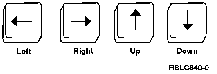
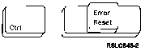

[Previous](2-5.md) | [Index](README.md) | [Next](2-6-1.md)

---

## 2.6 Cursor Movement Keys

the **cursor** **movement** **keys**. Again, not all keyboards are the same, and | these keys might be anywhere depending on which keyboard you are using. Find the four keys that have arrows on them, each key having an arrow pointing in a different direction. Personal computers may have two sets of these keys; take your pick.

PICTURE 17

The **Cursor** **Down** key moves the cursor down one line each time you press the of the cursor movement keys are **typematic**; they keep repeating as long as they are held down. The **Cursor** **Up** key moves the cursor up one line. Like the other cursor movement keys, this key moves the cursor one line or many lines depending on how long you hold down the key. The **Cursor** **Right** key moves the cursor to the right. Hold the key down. When the cursor reaches the right end of the line, it goes off the screen and reappears on the left side, one line below the line it was on. If the cursor is on the bottom line of the screen and is run all the way to the The **Cursor** **Left** key moves the cursor one position to the left. Hold this key down. When it reaches the left end of the line, it goes off the screen and reappears on the right, one line above the line it was on. If the cursor is on the top line of the screen and is run all the way to the left, it goes off the screen and reappears in the lower right corner. Play with the Keys: Play with the four cursor movement keys until you get used to them. Also, don't worry about damaging the computer by pressing the wrong key or doing something in the wrong sequence. Cursor movement | keys won't erase anything. ***Y***o***u can***'***t hu***r***t t***h***e comput***e***r*** b***y usi***n***g yo***ur ***| keyboar***d. The computer has built-in safeguards to automatically protect itself from typing mistakes. Press two cursor movement keys at once. Your cursor may be confused momentarily, but you won't hurt anything. Try pressing all four at once: no problem; the cursor might stop or the computer might beep at you, but that's just its way of saying, *Please* *stop;* *I'll* *be* *fine* *as* *soon* *as* *you* *release* *the* *keys*. **| Not**e: If your keyboard become**s lock**e**d** up (doesn't respond to anything you | do) because of a typing error, press the Error Reset key (the left | **Ct**rl key on most personal computers).

| PICTURE 18

Subtopics:

- [2.6.1 Making Keystroke Mistakes](2-6-1.md)

---

[Previous](2-5.md) | [Index](README.md) | [Next](2-6-1.md)
