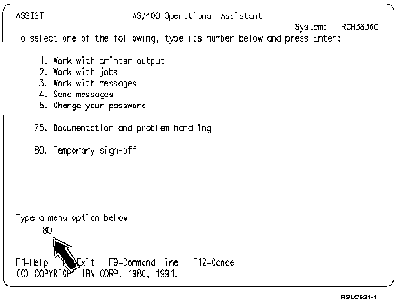

[Previous](2-7.md) | [Index](README.md) | [Next](2-8.md)

---

### 2.7.1 Temporary Sign-Off

| You may eventually find yourself working in an application, let's say word          | processing, and you have to leave for a meeting or lunch.  You want to                  | finish the document later, but you don't like the idea of having to wade        | through the series of AS/400 and application displays necessary to get to ???????????????????????????????????????????????????????????????  | where you were when you left off.          | Option 80 (Temporary sign off) allows you to temporarily suspend the           | application you are working in until you sign on for your next AS/400             | session.  After signing on again, you can go directly to where you left       | off, without having to work your way through a lot of unnecessary ?  | displays.

**How** **Long** **Is** **Temporary** You should be aware that there is a limit to the length of time you can be temporarily signed off. You should ask your system operator what this limit is for your system. If this time limit is exceeded,

| the job you were working on when you temporarily signed off will be | ended as if you had signed off directly from the application, or from | the AS/400 Main Menu (using option 90). | To temporarily sign off the AS/400 system from a display you are working [HDRKBDS](e-0.md)

on, simply press the **Attn** key (see Appendix E, "AS/400 Keyboards," to

[determine which key](e-0.md) is your Attn key). At this point, you should be | looking at the AS/400 Operational Assistant menu.

Figure 2-2. Using The Temporary Sign-Off Option.

Now type **80** on the menu option line, press the Enter key, and the Sign On menu appears. You are now temporarily signed off the system; at this point you could even switch your display station off if you wanted to. When you return to work, sign on as you normally would. Then, from the

AS/400 Operational Assistant menu, press the **F3** key to return to the

| display you were working on when you decided to temporarily sign off.

---

[Previous](2-7.md) | [Index](README.md) | [Next](2-8.md)
