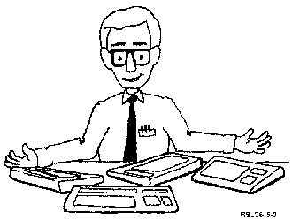

[Previous](2-8.md) | [Index](README.md) | [Next](3-1.md)

---

# 3.0 Chapter 3.  Your Keyboard

PICTURE 22.

**Please** **Note:**

Because there are so many possible display station/keyboard combinations that work with the AS/400 system, you may have to check Ap [pendix E, "AS/400 Keyboards" f](e-0.md) or specific differences on your keyboard. If you still have questions (pa*rticularly i*f *y*o*u're u*s*ing a* pe*rsonal c*o*mputer k*e*yboard),* refer to your display station or keyboard manual, or see your system administrator.

Subtopics:

- [3.1 Function Keys](3-1.md)
- [3.2 Keyboard Summary](3-2.md)

---

[Previous](2-8.md) | [Index](README.md) | [Next](3-1.md)
