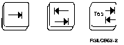
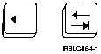
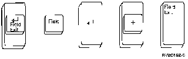
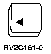

[Previous](3-1-1.md) | [Index](README.md) | [Next](3-1-2.md)

---

#### 3\.1\.1\.1 Field Keys

The last five engraved function keys all deal with **entry fields**\.

```
    ___ What Are Entry Fields? _____________________________________________
   |                                                                        |
   | Fields are really nothing more than blank lines (input areas) waiting  |
   | for information.                                                       |
   |                                                                        |
   | Some fields are very short, just long enough to type in a one- or      |
   | two-digit number.                                                      |
   |                                                                        |
   | Some are longer, designed for single words or command names like       |
 | | SNDMSG, which means Send Message.                                      |
   |                                                                        |
 | | A single entry field may consist of more than one line on the display  |
 | | (to accommodate long commands or even complete messages).              |
   |                                                                        |
   |________________________________________________________________________|
```

The following display is used to send a message\. It has one long field for the message and shorter fields for information about where the message will be sent\.

<a id="FIGFIGUNIQ35"></a>

```
    __________________________________________________________________________________ 
   |                                                                                  |
 | |                                  Send a Message                                  |
   |                                                                                  |
 | |  Type information below, then press F10 to send.                                 |
   |                                                                                  |
 | |    Message needs reply  . . . . . .   N            Y=Yes, N=No                   |
   |                                                                                  |
 | |    Interrupt user . . . . . . . . .   N            Y=Yes, N=No                   |
   |                                                                                  |
 | |    Message text . . . . . . . . . .   ___________________________________        |
 | | _________________________________________________________________________        |
 | | _________________________________________________________________________        |
 | | _________________________________________________________________________        |
 | | _________________________________________________________________________        |
 | | _________________________________________________________________________        |
 | | ____________________________________________________                             |
   |                                                                                  |
 | |    Send to  . . . . . . .             __________   Name, F4 for list             |
 | |                                       __________                                 |
 | |                                       __________                                 |
 | |                                       __________                                 |
 | |                                       __________                                 |
   |                                                                                  |
 | |  F1=Help   F3=Exit   F10=Send   F12=Cancel                                       |
   |                                                                                  |
   |                                                                                  |
   |__________________________________________________________________________________|
```

This next display, the Work with Jobs display, is an example of a display with small fields\. The column on the left has a short field for the entry of Options \(Opt\)\. The field is just long enough for 1 or 2 numbers\.

<a id="FIGFIGUNIQ36"></a>

```
    __________________________________________________________________________________ 
   |                                                                                  |
 | |                                  Work with Jobs                                  |
 | |                                                              System:   RCH38360  |
 | |  User . . . . . :   NORBERT                                                      |
   |                                                                                  |
 | |  Type options below, then press Enter.                                           |
 | |    3=Hold   4=Delete (End)   6=Release   7=Display message                       |
 | |    8=Work with printer output                                                    |
   |                                                                                  |
 | |       Job Queue/                                                                 |
 | |  Opt    Job         Status                                                       |
 | |       QBATCH                                                                     |
 | |   _     PAYROLL     Running                                                      |
 | |       OVERNITE                                                                   |
 | |   _     TAKESTIME   Waiting to run (1 of 1)                                      |
   |                                                                                  |
   |                                                                                  |
   |                                                                                  |
   |                                                                                  |
   |                                                                                  |
   |                                                                                  |
 | |                                                                          Bottom  |
 | |  F1=Help      F3=Exit   F5=Refresh   F9=Command line   F11=Display dates/times   |
 | |  F12=Cancel   F14=Select other jobs   F21=Select assistance level                |
   |                                                                                  |
   |                                                                                  |
   |__________________________________________________________________________________|
```

The following keys allow you to move through and around these fields\. You could just use your cursor, but these keys are faster\. ***Tab \(Field Advance\) Key***

The Tab \(Field Advance\) key moves the cursor to the start of the next field\.

<a id="FIGFIGUNIQ37"></a>



*Field Backspace Key*

<a id="FIGFIGUNIQ38"></a>



The Field Backspace key moves the cursor back to the previous field\.

To use the Field Backspace key:

- If you are using a personal computer, press the Shift key and then the Tab key\.
- For most other display station keyboards, just press the Field Backspace key\.

***Field Exit Key***

The Field Exit Key moves the cursor to the next field, but with a difference: any characters at and to the right of the cursor in the field where you were typing **are deleted**\. On most PC keyboards, the Field Exit key will be the right Ctrl key\.

<a id="FIGFIGUNIQ39"></a>



*New Line Key*

<a id="FIGFIGUNIQ40"></a>



The New Line key also moves the cursor to the next field, but if the original field has more than one line, the cursor moves down to the next line, not to the next field\.

For example, on the Send a Message display shown earlier, the Tab key takes you out of the *Message text* field into the *Send to* field, but the New Line key would just move you down a line in the *Message text* field\.

```
    ___ Be Careful _________________________________________________________
   |                                                                        |
 | | The Enter key on some personal computers looks like a New Line key.    |
 | | Pressing this key may prematurely submit the information you are       |
 | | entering.                                                              |
   |                                                                        |
   |________________________________________________________________________|
```

---

[Previous](3-1-1.md) | [Index](README.md) | [Next](3-1-2.md)
