[Previous](3-1.md) | [Index](README.md) | [Next](3-1-1-1.md)

---

### 3.1.1 Engraved Function Keys

The **engraved** **function** **keys** have words, abbreviations of words, or symbols printed on them rather than numbers. Generally, each of these keys performs a single function. In describing the keys, we will use the key

name that is used on *most* keyboards. Some of the engraved function keys shown below may not be available on your keyboard or, in some cases, may not correspond to the functions indicated. In such cases, refer to

[Appendix E, "AS/400 Keyboards,"](e-0.md) for other common keyboard layouts. Again**...** Your keyboard may not have all of these keys, or it may have different keys that perform the same functions. Just ignore the keys you don't recognize. Shift Key

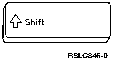

PICTURE 23.

You use it just as you would a typewriter shift key, to put the other keys into uppercase (capital letters). Depending on which keyboard you have, you might also use it at the same time as another key to perform a function. For instance, you might use it with another key to move up or down to new screens.

Shift Lock Key

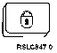

PICTURE 24.

The Shift Lock key is used to place the entire keyboard, | including numbers, in an uppercase (capital letters) mode. | To get out of uppercase mode, you press the Shift key. Caps Lock Key

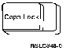

PICTURE 25.

The Caps Lock key is used to place the entire keyboard, | with the exception of the number keys, in an uppercase | mode. To get out of uppercase mode, you simply press the

Caps Lock key again (this is an example of a **toggle** key, which allows you to turn a mode on and off).

***Enter*** ***Key***

choose an option from a menu or display. You will use this key often.

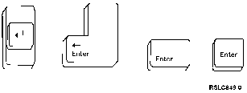

PICTURE 26.

, c.cp Alternative Key

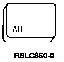

PICTURE 27.

The Alternative (Alt) key is used in combination with other | keys. It allows you to perform functions other than those actually shown on the keyboard (refer to [Appendix E,](e-0.md) [HDRKBDS](e-0.md)

"AS/400 Keyboards").

***Error*** ***Reset*** ***Key***

You can use the Error Reset key to reset or correct a keyboard error. You probably remember the four-digit error message on the message line of your

display when you played with your keyboard in [Chapter 2, "Signing On and](2-0.md) [Signing Off Your Computer."](2-0.md)| You use the Ctrl key as the Error Reset key on personal computer | keyboards.

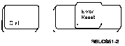

Control Key

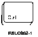

PICTURE 29.

You can use the Control key with the Alt key, the Escape (Esc) key, or the Shift key to do additional functions on various keyboards. On a few keyboards, the Control (Ctrl) key works as the Error Reset key. (All of this Control key

information is probably very confusing to you. You'll have

to check Appendix E, "AS/ [400 Keyboards" to see exactly](e-0.md) what this key does on your keyboard.) Help Key

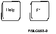

PICTURE 30.

If you are not using a personal computer as an AS/400 display station, you can press the Help key or the F1 key to display additional information about the display you are using, about messages you have received, or about other little problems which might happen. We'll talk about the various Help features at length later. If you are using a personal computer as an AS/400 display station, you don't have a key labeled Help. You can press F1 to get Help (unless your keyboard is locked up). Erase Input Key

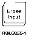

PICTURE 31.

The Erase Input key erases *all* of the information that you

have typed on the display. *Be* *careful*.

Insert Key

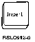

PICTURE 32.

The Insert key allows you to insert information on a line by letting you type the additional information while the existing information is moved to the right. Pressing the key a second time takes you out of the insert function. Delete Key

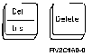

PICTURE 33.

You can use the Delete (Del) key to remove information from a display one letter at a time. On the 5250 keyboard you first hold down the shift key, then press the Delete key. Attention Key

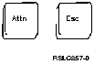

PICTURE 34.

This key can be used to get to Operational Assistant from | another part of the AS/400 system. If you press it while | at any non-Operational Assistant display, the AS/400 | Operational Assistant menu should be displayed. Print Key

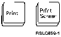

PICTURE 35.

The Print key is used to print the information currently

output queue (this will be explained in [Chapter 8,](8-0.md) "Managing Your Work" [) and printed at a l](8-0.md) ater time. A message is shown. You need to press the Error Reset key to unlock the keyboard. Page Up, Page Down Keys (Roll Keys)

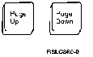

PICTURE 36.

On some keyboards, the Page Up and the Page Down keys are

called the Roll keys. These keys move information up or down on the display.

When **More...** is shown in the lower right corner of the display, you can use either the Page Down key or the Roll Up key to move toward the end of the information. When

Bottom is shown, **you h**ave reached the end of the information. Similarly, you use either the Page Up key or the Roll Down key to move toward the top of the information. How you use these keys depends on the type of display station you have: With a 5250 display station, press and hold the Shift key and press the appropriate Roll key. With personal computers and most other keyboards, just press the appropriate Page or Roll key., c.cp System Request Key

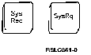

PICTURE 37.

Pressing the Shift key along with the System Request (Sys

Req or Sys Rq) key takes you to the System Request menu. From this display, you can send or receive messages, start another job, and do a few other things. We'll talk more

about the System Request menu in [Appendix D, "Additional](d-0.md) [Functions."](d-0.md)

Subtopics:

- [3.1.1.1 Field Keys](3-1-1-1.md)

---

[Previous](3-1.md) | [Index](README.md) | [Next](3-1-1-1.md)
