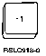
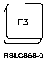
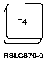
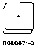
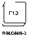
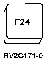

[Previous](3-1-2-2.md) | [Index](README.md) | [Next](3-2.md)

---

#### 3.1.2.3 A Few Special F Keys

Although you will discover that different F keys are shown on the many different displays and menus, a few old standbys almost always show up. Here are a few which you will use often:

PICTURE 42.

F1=Help If you don't have a regular Help key on your keyboard, this is your Help key. If you have both, you can use either one.

PICTURE 43.

F3=Exit Think of this key as an old friend. Anytime you want to get out of whatever you are doing, press it. Officially, the F3 key is used to exit the program or function you are in and return you to the display from which the current function was requested. Anyway, when in doubt, use it.

PICTURE 44.

F4=Prompt You will use this key nearly as much as F3. This key is called the prompt key, and it **takes** you from a menu

to a **command** **prompt** **display**. It's also used a lot to get lists to choose from. You'll find out a lot more

about command prompt displays in Appendix A, "Usi [ng](a-0.md) [Control Language Commands."](a-0.md)

PICTURE 45.

F5=Refresh This key removes any information you may have typed into a field. This key is a handy key to use when working with a command prompt display. It not only removes changes you may have made, but it also displays all of the original values. Another important use of the F5 key is to get a fresh snapshot picture o*f what's* happening on the system. You'll use this function later when you want to update your displays.

PICTURE 46.

F12=Cancel This key is easily confused with F3, but while F3 takes you completely out of a situation, F12 (usually) only takes you back to the previous screen.

PICTURE 47.

**F24=More** **keys**

If you can't find a particular function key, don't give | up! Many displays have more active function keys than | can be shown in the space provided. In such cases, | you'll see that one of the active function keys is F24 | (More keys). A list of additional active function keys | will replace the current list of active function keys | when you press the F24 key--you may have to press the | F24 key more than once to display all the active | function keys available. **And** **Now...** You should be a keyboard expert. Congratulations! Next, you will learn how to use displays.

---

[Previous](3-1-2-2.md) | [Index](README.md) | [Next](3-2.md)
