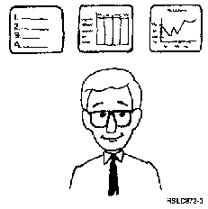

[Previous](4-4.md) | [Index](README.md) | [Next](5-1.md)

---

# 5.0 Chapter 5.  Using Displays

<a id="HDRDISPLAY"></a>

<a id="FIGUNIQ49"></a>



PICTURE 49.

All of the work you do with the AS/400 system will center around **displays**, the information shown on your display station's screen. You've already worked with two kinds of displays, a **menu** and the Sign On **entry** display. Menus help you to get started on a task by showing you options. Entry displays allow you to interact with the computer. There are four kinds of displays in all.

**The** **Four** **Kinds** **of** **Displays**

Menu displays Entry displays List displays Information displays Although the four kinds of displays look and act differently, they have three things in common: 1. They have **titles**. 2. They list their **active** **function** **keys**. 3. They explain their **purpose**., c.cp characteristics:

<a id="FIGUNIQ50"></a>

```text
    __________________________________________________________________________________ 
   |                                                                                  |
 | |  ASSIST                   AS/400 Operational Assistant                           |
   |_____________________________________________________________|
 | |                                                              System:   RCH38360  |
 | |  To select one of the following, type its number below and press Enter:          |
   |                                                                                  |
   |_____________________________________________________________|
 | |       1. Work with printer output                                                |
   |__________________|
 | |       2. Work with jobs                                                          |
   |__________________|
 | |       3. Work with messages                                                      |
   |__________________|
 | |       4. Send messages                                                           |
   |_____________________________________________________________|
 | |       5. Change your password                                                    |
   |                                                                                  |
 | |      75. Documentation and problem handling                                      |
   |                                                                                  |
 | |      80. Temporary sign-off                                                      |
   |                                                                                  |
   |                                                                                  |
   |                                                                                  |
   |                                                                                  |
   |                                                                                  |
   |                                                                                  |
   |_____________________________________________________________|
 | |  Type a menu option below                                                        |
 | |       __                                                                         |
   |                                                                                  |
 | |  F1=Help   F3=Exit   F9=Command line   F12=Cancel                                |
 | |  (C) COPYRIGHT IBM CORP. 1980, 1991.                                             |
   |                                                                                  |
   |__________________________________________________________________________________|
```

**Let's** **Get** **Busy**

While you're reading this chapter, you might as well be looking at some displays first hand. Turn on your display station if it isn't | already. Sign on; let's examine your AS/400 Operational Assistant | menu more closely.

**Note:** It's possible that someone has set up the computer to bring up a menu other than Operational Assistant.

The title of this display, **AS/400** **Operational** **Assistant**, is in the center of the top line. (A shortened version (ASSIST) is in the top left corner.

| You can use this shortened name, o**r me**n**u** ID, to get to a particular menu | quickly. We explain more about this in [Appendix B, "Advanced Men](b-0.md) u [| Planning.](b-0.md)") The active function keys are listed on the bottom of the display: | F1=Help | F3=Exit | F9=Command Line | F12=Cancel

**Note:** Depending on your authority and the way your system is set up, the F9 key may not be available on your display., c.cp The purpose of the display is explained in the middle part of the display. There are four kinds of displays:

Because this is a menu display, there are options listed from which

you? can choose to do various tasks. **Entry** **displays** have fields to be filled. (Remember fields ) **List** **displays** have lists, obviously. **Information** **displays** show information that instructs or directs you just the same as reading from a book.

Subtopics:

- [5.1 Menu Displays](5-1.md)
- [5.2 Entry Displays](5-2.md)
- [5.3 List Displays](5-3.md)
- [5.4 Information Displays](5-4.md)
- [5.5 Using Displays Summary](5-5.md)

---

[Previous](4-4.md) | [Index](README.md) | [Next](5-1.md)
