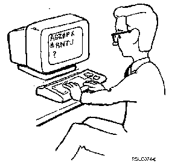

[Previous](5-1-1.md) | [Index](README.md) | [Next](5-1-3.md)

---

### 5.1.2 Using the Message Line

PICTURE 51.

| `Specifi`e`d me`n`u selecti`o`n` i`s n`o`t correc`t. | If you forget to type an option number and then press the Enter key, the | computer reminds you to do this with the message: | `Ty`p`e opti`o`n numbe`r. | **Err**o**r Messa**g**e He**lp | You can get additional information about an error message by putting | your cursor on the message and pressing the Help key. | In either case, your cursor moves back to the beginning of the menu option | line. Now you can type a real option number right over the fake one. If | a number (or letter) is left over from the previous attempt, you must get | rid of it or you'll get another error message. | There are several ways to eliminate extra characters. The best way to do | it is to use the Erase Input key (or the Field Exit key). If you don't | have either of those keys, we have other ways. Using the spacebar is fairly fast, or you can use your Delete key.

---

[Previous](5-1-1.md) | [Index](README.md) | [Next](5-1-3.md)
