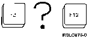

[Previous](5-1-2.md) | [Index](README.md) | [Next](5-1-4.md)

---

## 5.1.3 More Menus and Displays

| 75 for the Documentation and Problem Handling option. Press the Enter | key.

| Type a menu option below | __ | F1=Help F3=Exit F9=Command line F12=Cancel | (C) COPYRIGHT IBM CORP. 1980, 1991. .

| so pay special attention to the menu I*D USERHE*LP that appears in the | upper left corner of the display. | 2. Let's go farther. To examine one of the displays that can be accessed | from this menu, typ**e** 1 on the menu option line and press the Enter | key. The How to Use Help display appears.

| Help is provided for all AS/400 displays. The type of help provided | depends on the location of the cursor. | o For all displays, the following information is provided: | What the display is used for | How to use the display | How to use the command line if there is one | How to use the entry fields and parameter line if any | What function keys are active and what they do | o The following information is also provided for specific areas, | depending on the type of information being displayed: | Menus: Meaning of each option | Entry (prompting) displays: Meanings and use of all values for | each entry field | List displays: Meaning and use of each column | More... | F3=Exit F12=Cancel | (C) COPYRIGHT IBM CORP. 1980, 1991. .

PICTURE 52.

What's th**e Diff**e**ren**c**e** | There is actually a difference between the F3 key and the F12 key. | However, it does not matter which key you use when you're just | going back a single display. Later, when you are dealing with | different kinds of displays, you will use the F3 key to go back | several displays to th**e la**s**t me**nu that was used. In most cases, the F12 key only takes you back to the previo**us displ**a**y, whet**her it is a menu, an informational display, or whatever. * 4. For now we'll use the F3 key, because that's the key you'll be using | most often. Press F3. You don't have to press the Enter key after | pressing a function key. | 5. You're back one display to the Documentation and Problem Handling | menu. Now press the F3 key again. | 6. And you're back home to the AS/400 Operational Assistant menu!

---

[Previous](5-1-2.md) | [Index](README.md) | [Next](5-1-4.md)
