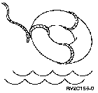

[Previous](5-1-3.md) | [Index](README.md) | [Next](5-2.md)

---

### 5.1.4 Help, Help

PICTURE 53.

Help key, and he**lp a**ppears on the display. | Help information is covered completely in [Chapter 6, "Using](6-0.md) Online Informati [on," but you might w](6-0.md) ant to use it now, to get information about a particular display. So we'll give you a little head start with Help. | If the cursor is on the blank menu option line when the | Help key is pressed, general help for the current menu is | displayed. (Later you'll see how placing the cursor in other parts of a display gives you more specific information.) | Let's check it out. From the AS/400 Operational Assistant

menu, select option **75** (Documentation and problem handling). The Documentation and Problem Handling menu appears, with the cursor obediently on the menu option line. Now you

| simply press the Help key to get additional information | about this menu display. | USERHELP Documentation and Problem Handling | .............................................................................. | Documentation and Problem Handling | | This option provides additional information about the system and is | useful in attempting to resolve problems. | | Use this information when you want to work with a technical support | person to resolve a problem. | | Related Topics | | For more information, select one of the following:

: o Operational Assistant overview :

| o OA list of topics | | Option 1. How to use help | | This option explains how to display help for: | More... ' | F3=Exit help F10=Move to top F11=Search index F12=Cancel | F13=User support F14=Print help | | :............................................................................: | The Help display explains the purpose of the menu and how to enter options and commands. | To aid in the following discussion, let's print a copy of this display so | you'll have some output shown on the Work with Printer Output display. To | do this, simply press the F14 (Print help) key while viewing the help | display.

---

[Previous](5-1-3.md) | [Index](README.md) | [Next](5-2.md)
