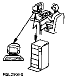

[Previous](6-4.md) | [Index](README.md) | [Next](7-1.md)

---

# 7\.0 Chapter 7\. Messages

This chapter is all about messages\. A message is any communication sent from one point in the AS/400 system to another\.

These messages might be between you and the computer or between you and another person using the system\. Think of messages as mail that you send and receive\.

The two most common types of messages are:

- Informational messages
- Inquiry messages

Subtopics:

- [7\.1 Informational Messages](7-1.md)
- [7\.2 Inquiry Messages](7-2.md)
- [7\.3 Message Queues](7-3.md)
- [7\.4 Message Sources](7-4.md)
- [7\.5 Where Will They Be](7-5.md)
- [7\.6 Sending Messages](7-6.md)
- [7\.7 Receiving Messages](7-7.md)
- [7\.8 Deleting Messages](7-8.md)
- [7\.9 Message Summary](7-9.md)

---

[Previous](6-4.md) | [Index](README.md) | [Next](7-1.md)
