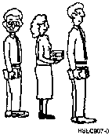

[Previous](7-2.md) | [Index](README.md) | [Next](7-4.md)

---

## 7.3 Message Queues

PICTURE 61.

Instead, they are held in your message queue.

**What's** **a** **Queue?**

A queue is a line of things waiting for their turn to do something. | contai**n us**e**r messag**es and another to contai**n wo**r**k stati**o**n messag**es. | User messages are messages that have been sent to your user name. Work | station messages are messages that have been sent to the work station that | you are currently signed onto. When a message is placed in your message queue, and your message queue is in **notify** mode (the usual mode), a little light (Message Waiting light) or a buzzer or both may be activated to alert you of the message.

---

[Previous](7-2.md) | [Index](README.md) | [Next](7-4.md)
