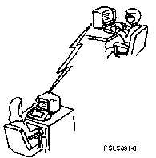

[Previous](7-6.md) | [Index](README.md) | [Next](7-7.md)

---

### 7\.6\.1 Let's Practice Sending a Message

<a id="FIGFIGUNIQ82"></a>



Before you can send someone a message, you need to know the person's **user name**\. If you don't know anyone's user name, run down the hall and find someone who will help you out \(you could also press the F4 key for a list of user names\)\.

Tell your partner \(and potential new friend\) you need practice sending messages\. Invite the person to participate in your AS/400 education by giving you his or her user name\.

For those of you who are too shy to send a real message right now, we'll make up a person and a reason to send a message\. \(Or, you can send the following message to yourself\. Remember to type in your own user name in the *Send to* field\.\)

Just suppose you need to remind Teresa of something very important\. On the Send a Message display, you simply type the message on the *Message text* field, then move to the *Send to* field and type her user name:

```
    __________________________________________________________________________________
   |                                                                                  |
 | |                                  Send a Message                                  |
   |                                                                                  |
 | |  Type information below, then press F10 to send.                                 |
   |                                                                                  |
 | |    Message needs reply  . . . . . .   N            Y=Yes, N=No                   |
   |                                                                                  |
 | |    Interrupt user . . . . . . . . .   N            Y=Yes, N=No                   |
   |                                                                                  |
 | |    Message text . . . . . . . . . .   Teresa, don't forget that tomorrow is my   |
 | | turn to be the quality control person on the doughnut line.____________________  |
 | | _______________________________________________________________________________  |
 | | _______________________________________________________________________________  |
 | | _______________________________________________________________________________  |
 | | _______________________________________________________________________________  |
 | | _______________________________________________________________________________  |
 | | ____________________________________________________                             |
   |                                                                                  |
 | |    Send to  . . . . . . .             TGREEN____   Name, F4 for list             |
 | |                                       __________                                 |
 | |                                       __________                                 |
 | |                                       __________                                 |
 | |                                       __________                                 |
   |                                                                                  |
 | |  F1=Help   F3=Exit   F10=Send   F12=Cancel                                       |
   |                                                                                  |
   |__________________________________________________________________________________|
```

This is an informational message \(you are simply sending Teresa a memory jogger\), so you don't need a reply, and it isn't really important enough to send as a break message\. However, if you want to ask Teresa whose turn it is to be the quality control person, you have to type **Y** in the *Message needs reply* field to specify that an inquiry message is to be sent\.

Also, if the message is really important, you can type **Y** in the *Interrupt user* field so that the message is displayed on Teresa's display station immediately \(if she is signed on at the time\)\. Again, you should use break messages with care\!

---

[Previous](7-6.md) | [Index](README.md) | [Next](7-7.md)
