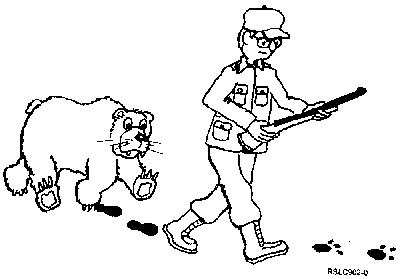
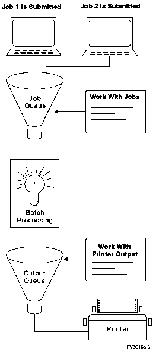
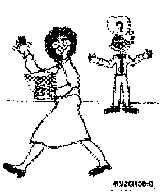

[Previous](8-1-1.md) | [Index](README.md) | [Next](8-3.md)

---

## 8.2 Tracking Your Job

PICTURE 66.

It is important to know the flow of a job so that you can track it through the system and display or change its status. This allows you to: | End or hold a batch job. Answer messages sent by the system. | Control printer output. The flow of a job can have up to five steps: | 1. A user or program submits a job to be run. | 2. The system places the job on a job queue. | 3. The system takes the job from the job queue and runs it. | 4. If this job creates some information (output) that needs to be | printed, the printer output is placed on an output queue. | 5. The system takes printer output from the output queue and sends it to | the desired printer to be printed.

**Note:** Not all jobs need to include steps 4 and 5.

PICTURE 67.

| Let's say that Frieda and Norbert have submitted their monthly reports at | about the same time. They both want their report printed, but there is only one printer available. | Do they argue Do they arm wrestle No, the operating system simply | places their jobs in a **job** **queue** in the order in which they were received. | A job queue can be considered a line of jobs that are waiting to be run; | generally, jobs run in the order in which they entered the job queue. | The computer takes jobs from the job queue and runs them. As each job is | run, the system sends the printer output to the **output** **queue**. | The output queue is similar to the job queue in that it can be considered | a line where the printer output of each batch job must wait its turn to be | printed. Again, printer output generally prints in the order that it | enters the output queue. Printer output remains in the output queue until | it is either printed or deleted. | Finally, the printer takes the printer output from the output queue and | produces the printed copy. | As it happens, Frieda's job was printed first this time. However, just | because one job was submitted before another doesn't mean it will be | printed first. A variety of factors can affect the length of time it | takes for a job to run. These factors include such things as job length, | the type of processing involved, and job priority.

| PICTURE 68.

| Better luck next time, Norbert!

---

[Previous](8-1-1.md) | [Index](README.md) | [Next](8-3.md)
