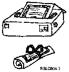

[Previous](8-5.md) | [Index](README.md) | [Next](a-0.md)

---

## 8.6 Let's Try It!

```text
   Although the AS/400 system allows you to perform many different tasks, we
   can't take you through a realistic demonstration of the process because we
   haven't been working with any application programs.  In this book, our
   discussions are intended to familiarize you with the system so that you
   can make your company's applications run efficiently.

   In your actual working environment, you might be working with a word
   processing program, a payroll program, a program that controls some phase
   of manufacturing, or any other of thousands of programs that make the
   AS/400 system the extraordinary tool it is.  In other words, you have in
   front of you a machine that is all dressed up with no place to go.

   However, one thing you can do is print something that will serve as a    | review of most of the functions discussed in this book.
```

`Print` `operation` `complete` `to` `the` `default` `printer` `device` `file.`

| This means that your print job has been put in an output queue and may | already have been printed (depending on how busy your printer is). | You'll notice that your keyboard has been temporarily locked up. 5. Press the Error Reset key (or your keyboard will remain locked up).

**Note:** To print the whole list, you'll need to page down to view the

rest of the displays (Chapter 3, ["Your Keyboard"). Repeat t](3-0.md) he | above procedure for each screen you want printed. | 6. You now have something of your very own shown on the Work with Printer | Output display. Let's check: | a. From the AS/400 Operational Assistant menu, select option 1 (Work | with printer output). | b. There it is! You can tell where your output is in the system by | looking at the status column. The printer output for the displays | that have been placed in the output queue appear. The status of the printer output for the first display that you submitted will

probably be **Printing** **page** **1** **of** **1**, (meaning it's printing now). The remaining printer output will probably have a status of

**Waiting** **to** **print**. The status of any printer output will change as it is printed. You can check on the changing status of all printer output by pressing F5 (Refresh). 7. Now, you can go over to the printer to see if your diploma is finished. If there are several printers, simply check the

*Printer/Output* column on the Work with Printer Output display to determine which printer the output was defaulted to. The printer name is located just above the output name (QSYSPRT in this case).

<a id="FIGUNIQ88"></a>



PICTURE 69.

Now roll up the paper and tie a ribbon around it. Congratulations.

---

[Previous](8-5.md) | [Index](README.md) | [Next](a-0.md)
