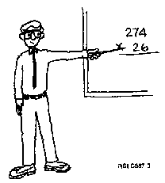

[Previous](a-3-2.md) | [Index](README.md) | [Next](b-0.md)

---

## A.4 Control Language Summary

PICTURE 73.

A command name consists of an action (verb) and an object (suffix). A CL command consists of a command name and parameters. A parameter consists of a keyword and a value. | A parameter value can be either a user-defined value or a system-defined value. System-defined values begin with an asterisk. Some parameters are required and must be assigned a value. Others are optional and often have a default value assigned to them. CL commands are entered into the system in two ways: Using the command prompt display Free format Either method can be used on system menus or the command entry display. To see the command prompt display, you enter the command on the command line and press F4. The system displays the command's parameters. The parameters are listed and default values are entered for you. Only required parameters that do not have default values need to be completed by the user. Command prompting is used: When entering an unfamiliar command When additional assistance is required for a known command You use the free format method by entering the command and its parameters as a string of characters on a command line. This method is used when entering familiar commands.

---

[Previous](a-3-2.md) | [Index](README.md) | [Next](b-0.md)
