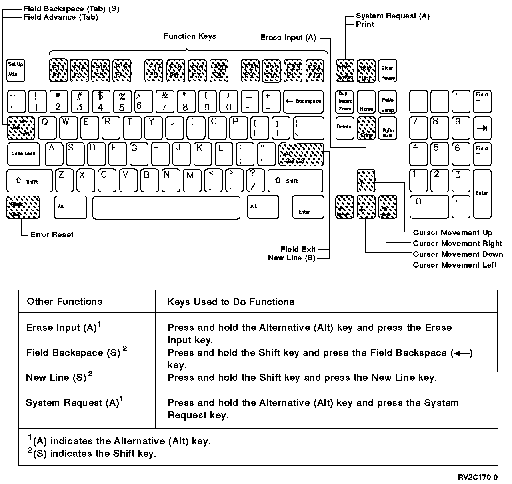

[Previous](e-0.md) | [Index](README.md) | [Next](e-2.md)

---

## E.1 Using the IBM-Enhanced Keyboard

Shown below is the IBM*-enhanced keyboard.

Figure E-1. Using the IBM-Enhanced Keyboard.

To use function keys 1 through 12: Press the appropriate function key. To use function keys 13 through 24: 1. Press and hold the Shift key. 2. Press the function key that corresponds to the number of the desired function key. 3. Release both keys.

---

[Previous](e-0.md) | [Index](README.md) | [Next](e-2.md)
