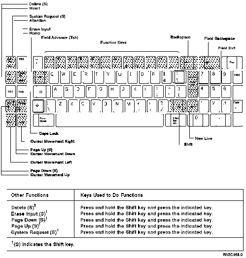

[Previous](e-2.md) | [Index](README.md) | [Next](e-4.md)

---

### E.3 Using the 5250 Keyboard

Shown below is the 5250 keyboard.

Figure E-3. Using a 5250 Keyboard.

Shift 1. Press and release the Command (Cmd) key. 2. Press and hold the Shift key. 3. Press the top row key that corresponds to the number of the desired function key. For example, the 1 key is used as function key 13, the 0 key is used as function key 22, the - (minus) key is used as function key 23, and the = (equal) key is used as function key 24.

---

[Previous](e-2.md) | [Index](README.md) | [Next](e-4.md)
